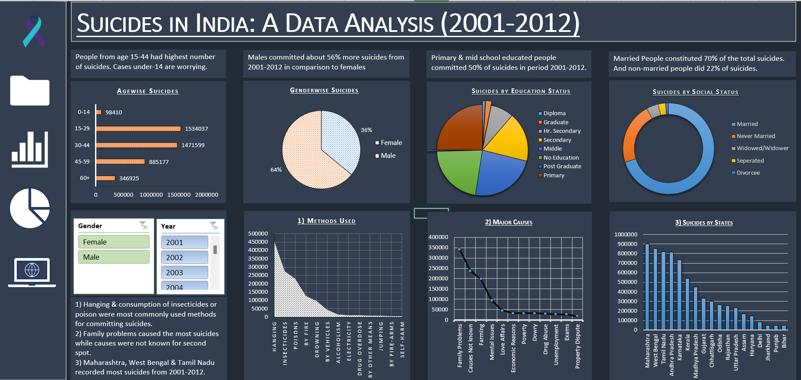

# Suicides in India (2001–2012) – Excel Dashboard

## 📊 Project Overview

This Excel dashboard visualizes suicide trends in India over the period of 2001 to 2012 using various demographic, social, and geographical dimensions. The aim is to highlight patterns and key insights to better understand the underlying issues and draw attention to areas that may require focused intervention.

---

## 📁 Repository Structure

```
├── Data
│   └── Suicides in India 2001-2012.csv
│
├── Images/
│   ├── Dashboard/
│       ├── main_dashboard.png
│       
├── Workbook/
│   └── Excel_DashBoard.xlsx
|   
```

---

## 📊 Dashboard Overview



The **Suicides in India 2001-2012** consists of multiple visual components:


## 🔍 Key Features

- **State-wise breakdown**: Explore the geographical distribution of suicides across India.  
- **Gender-wise analysis**: Understand the disparities and nuances between male and female suicides.  
- **Age-wise insights**: Delve into the age demographics to grasp the impact on different age groups.  
- **Causes exploration**: Uncover the underlying reasons behind these tragic occurrences.  
- **Means adopted**: Gain insights into the methods chosen for these unfortunate incidents.  
- **Social & educational context**: Examine the correlation between social and educational factors with suicides.  
- **Dynamic slicers**: Seamlessly navigate through years and genders to track changes over time.  

This project isn't just about numbers; it's about shedding light on a critical issue and fostering understanding. Let's work together towards creating awareness and initiating meaningful conversations.

## 📌 Key Insights

- **Age-wise**: Individuals aged **15–44** had the highest number of suicides. Alarming trends also exist in the under-14 category.
- **Gender**: **Males** committed ~56% more suicides than females over the 12-year period.
- **Education**: **Primary and middle school educated** individuals accounted for ~50% of the total suicides.
- **Social Status**: **Married people** constituted around 70% of the suicide cases.
- **Methods Used**: Hanging and **insecticide consumption** were most commonly used.
- **Causes**: Family problems were the leading cause, followed by unknown causes.
- **States**: Highest numbers were recorded in **Maharashtra**, **West Bengal**, and **Tamil Nadu**.

## 🧭 Filters Available

- **Gender**: Allows toggling between Female and Male.
- **Year**: Select specific years from **2001 to 2012** to observe trends over time

---

## 📌 Technologies Used

- **Microsoft Excel** for data visualization
- Pivot charts, slicers, and filters for interactivity
- Clean and dark-themed dashboard design

---

## 📈 Insights Gained
- Identify the most polluted cities and countries in Asia
- Observe seasonal trends in pollution levels
- Compare cities and countries using dynamic filtering
- Evaluate policy implications for high-risk regions

---

## 📂 Tableau Workbook

Located in [`Workbook/`](./Workbook):
- `Excel_Dashboard.xlsx` – Excel workbook

---

