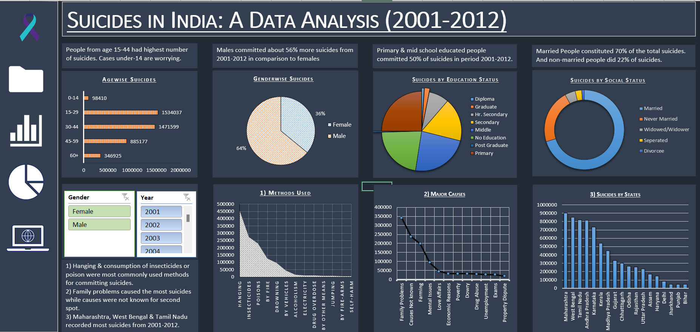

# Suicides in India (2001–2012) – Excel Dashboard

## Project Overview

This Excel dashboard visualizes suicide trends in India over the period of 2001 to 2012 using various demographic, social, and geographical dimensions. The aim is to highlight patterns and key insights to better understand the underlying issues and draw attention to areas that may require focused intervention.

---

## Repository Structure

```
├── Data
│   └── Suicides in India 2001-2012.csv
│
├── Images/
│   ├── Dashboard/
│       ├── main_dashboard.png
│       
├── Workbook/
│   └── Excel_DashBoard.xlsx
|   
```

---

## Dashboard Overview



The **Suicides in India 2001–2012** dashboard consists of multiple visual components designed for interactive exploration of the data.

---

## Key Features

* **State-wise breakdown**: Explore the geographical distribution of suicides across India.
* **Gender-wise analysis**: Understand disparities between male and female suicides.
* **Age-wise insights**: Analyze how different age groups are affected.
* **Causes exploration**: Examine reported reasons behind suicide cases.
* **Means adopted**: Understand the methods used in these incidents.
* **Social & educational context**: Study correlations with marital status and education levels.
* **Dynamic slicers**: Filter by year and gender for trend analysis.

This project aims to provide a data-driven perspective on a critical social issue and encourage informed discussion and awareness.

---

## Key Insights

* **Age-wise**: Individuals aged **15–44** recorded the highest number of suicides, with concerning cases also among those under 14.
* **Gender**: **Males** accounted for approximately 56% more suicides than females over the 12-year period.
* **Education**: Individuals with **primary and middle school education** made up about half of total cases.
* **Social Status**: **Married individuals** represented nearly 70% of recorded suicides.
* **Methods Used**: Hanging and **insecticide consumption** were the most common methods.
* **Causes**: **Family problems** were the leading reported cause, followed by unspecified reasons.
* **States**: The highest numbers were reported in **Maharashtra**, **West Bengal**, and **Tamil Nadu**.

---

## Filters Available

* **Gender**: Toggle between male and female data
* **Year**: Select any year from **2001 to 2012** to analyze trends

---

## Technologies Used

* **Microsoft Excel** for data visualization
* Pivot tables, charts, and slicers for interactivity
* Clean, dark-themed dashboard design

---

## Insights Gained

* Identified high-risk age groups and vulnerable demographics
* Observed gender disparities in suicide rates
* Analyzed the impact of marital status and education
* Highlighted major causes and commonly used methods
* Compared trends across different states and years

---

## Workbook

Located in `Workbook/`:

* `Excel_Dashboard.xlsx` – Excel dashboard file
